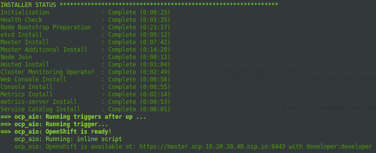

# vagrant-openshift-aio

This project aims to provision a RHEL 7.5 virtual machine with OpenShift Enterprise or CentOS 7 with OKD, both all-in-one, using `openshift-ansible` with container storage, router, registry, metrics, logging and no APB by default.

You can change `OPENSHIFT_DEPLOYMENT_TYPE` and `OPENSHIFT_RELEASE` and `MACHINE_IP` in `Vagrantfile` file or use environment varibles. It defaults to `origin`, `v3.10` and `10.20.30.40` respectively, but can be set to `openshift-enterprise`, `v3.11` and any other private IP of your preference that does not conflict with your network.

After `guest vm` is up you'll be able to access your OpenShift instance at: `https://master.ocp.10.20.30.40.nip.io:8443` or `https://master.okd.10.20.30.40.nip.io:8443` with `developer:developer`.

> **NOTE:** You can configure your inventory in `ansible/templates/all-in-one.ini` file.

# Pre-requirements

1. Install libvirt, virt-manager and net-tools

```
dnf install -y qemu-kvm libvirt virt-manager virt-install bridge-utils net-tools nmap git docker
systemctl start libvirtd.service 
systemctl enable libvirtd.service
```

2. Install ansible, vagrant-libvirt provider

```shell
dnf install -y ansible vagrant-libvirt
```

# Steps

1. Set Environment Variables (Optional):

```shell
export OPENSHIFT_DEPLOYMENT_TYPE=openshift-enterprise
export OPENSHIFT_RELEASE=v3.11
export OPENSHIFT_MACHINE_IP=10.20.30.40
```

2. Build RHEL 7.5 image using [packer](https://www.packer.io/downloads.html):

2.1 For **openshift-community** (OKD):

```shell
git clone https://github.com/aelkz/packer-rhel
cd packer-rhel
# Download rhel-server-7.5-x86_64-dvd.iso and put it in the current directory.
CHECKPOINT_DISABLE=1 PACKER_LOG=1 PACKER_LOG_PATH=~/packer.log ~/packer build x86_64-vagrant-ocp.qemu.json
cd ..
mv packer-rhel/rhel-7.5-ocp.box .
```

2.2 For **openshift-enterprise**:

```shell
git clone https://github.com/aelkz/packer-rhel
cd packer-rhel
# Download rhel-server-7.5-x86_64-dvd.iso and put it in the current directory.
CHECKPOINT_DISABLE=1 PACKER_LOG=1 PACKER_LOG_PATH=~/packer.log ~/packer build -debug -var 'rhn_username=user' -var 'rhn_password=pass' -var 'pool_id=f1d2s3a4r5e6w7q' x86_64-vagrant-ocp.qemu.json
cd ..
mv packer-rhel/rhel-7.5-ocp.box .
```

3. Set RHN Credentials:

- Create `ansible/vars/credentials.yml` with `ansible-vault` and the following content:

```yaml
rhn_username: user
rhn_password: p@ss
pool_id: pool-id-with-ocp
```

- Create `.vault` with your vault password.

```shell
echo 'vault-p@ss' > .vault
```

4. Start vagrant 

```shell
vagrant box add rhel-7.5-ocp file:////...your-project-directory.../rhel-7.5-ocp.box
vagrant up --provider libvirt
```

Expected output after openshift-ansible process:



## Limitations

- Only tested with libvirt.
- A valid subscription is required (for openshift-enterprise).

## Troubleshooting

In `/etc/nfs.conf` I had to uncomment two lines:

```shell
[nfsd]
udp=y
```

and then had to restart nfs:

```shell
sudo systemctl restart nfs-server.service
```

